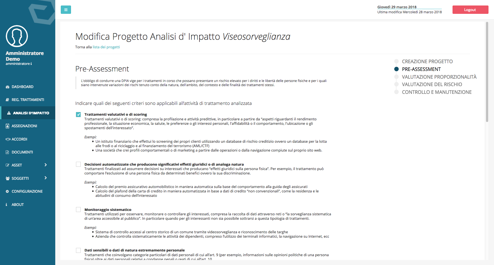

##################
Analisi di petto
##################

L’analisi d’impatto nel DPM è strutturata nella forma di un percorso
guidato composto da cinque passaggi:

Creazione progetto 
-------------------
Il primo passaggio consiste creazione del
progetto di analisi e nell’indicazione dell’attività di trattamento
sulla quale si desidera effettuare l’analisi d’impatto.

.. image:: ../_images/analisi_impatto_1.png
   :width: 500px

Pre-Assesment:
---------------
Il secondo passaggio è costituito da un
questionario che scaturisce da quello definito nelle linee guida
del Gruppo di lavoro articolo 29, “WP 248 rev.01”.
Qui è opportuno apporre la spunta sulle circostanze che ricorrono
nell’attività di trattamento.

Valutazione proporzionalità in relazione alla finalità:
--------------------------------------------------------

In questo passaggio si chiede di confermare che le categorie di dati, quelle di
interessati e la base legale su cui viene effettuato il trattamento,
siano proporzionali e necessarie alle finalità per la quale si
trattano i dati.

Gestione del rischio:
---------------------

La gestione del rischio in DPM è strutturata in due passaggi

1. Inserimento e valutazione dei rischi: i rischi possono impattare
   su vulnerabilità strutturali, applicative o organizzative. Il
   primo passaggio è quello di definire il rischio e valorizzare gli
   indici da cui il software deriva i valori dell’impatto e della
   probabilità, il cui prodotto fornisce l’indice numerico che
   rappresenta la gravità del rischio.

2. Mitigazione dei rischi: è possibile definire dei controlli di
   sicurezza che impattano su una delle quattro variabili a partire
   dalle quali si definisce il rischio, valorizzando uno dei quattro
   campi di un controllo di sicurezza si andrà ad abbassare l’indice
   numerico che rappresenta il rischio finale.

   Di seguito una rappresentazione grafica della logica
   usata per il calcolo del rischio.[1]

Controllo e manutenzione:
----------------------------

Nell’ultima scheda è possibile definire
lo stato di evoluzione del progetto di Analisi di Impatto:

-  In corso

-  In attesa di revisione

-  Completato

Nel caso il progetto sia completato è opportuno definire una data
per la revisione dell’analisi, nel campo “Data del prossimo
controllo”.

.. image:: ../_images/analisi_impatto_5.png
   :width: 500px

.. [1]
   Logiche per calcolo indici di rischio derivano dal docuimento “Data
   Protection Impact Assessment Template for Smart Grid and Smart
   Metering system” 2014, studio commissionato dalla Commissione
   Europea, disponibile all’indirizzo:
   https://ec.europa.eu/energy/en/test-phase-data-protection-impact-assessment-dpia-template-smart-grid-and-smart-metering-systems

