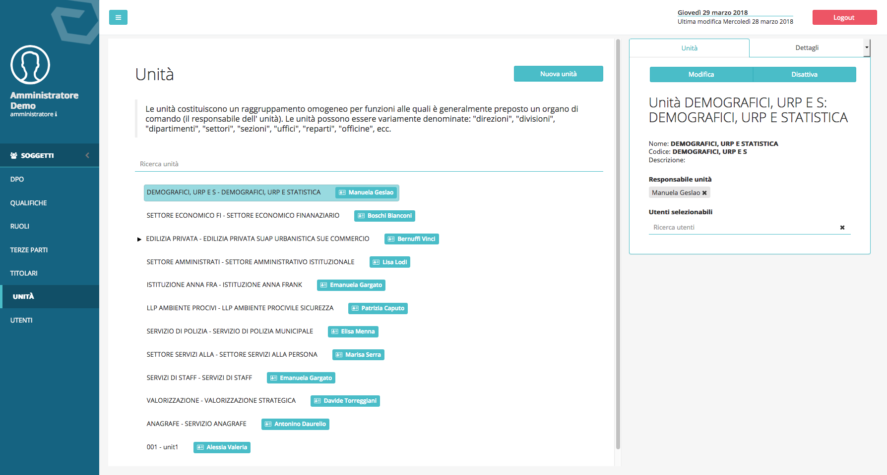

##############################
Privilegi e ruoli degli utenti
##############################

Privilegi utenti e ruoli predefiniti
------------------------------------

Per impostazione predefinita DPM viene fornito con cinque tipologie di
utenti a cui corrispondono privilegi applicativi diversi. I privilegi
corrispondono alla possibilità o mento di usufruire di funzionalità
dell’applicativo presenti nel menu posizionato sulla sinistra
dell’interfaccia grafica:

-  **Amministratore**: utente con privilegi massimi;

-  **DPO:** Dashboard, Registro dei trattamenti, Analisi d’impatto,
   Asset e Soggetti.

-  **Responsabile unità**: Registro dei trattamenti, analisi d’impatto,
   assegnazioni, documenti.

-  **Delegato**: Dashboard dell’incaricato, assegnazioni.

-  **Incaricato:** Dashboard dell’incaricato.

Gestione dei privilegi degli utenti
-----------------------------------

Gli utenti con ruoli di amministrazione possono modificare i
privilegi correlati agli altri ruoli ed inserire nuovi ruoli
configurandone permessi privilegi in maniera granulare, tramite
l’interfaccia visualizzabile facendo clic sul menu: **Soggetti →
Ruoli**.

.. image:: ../_images/lista_ruoli.png
   :width: 500px

Gestione delle unità organizzative e dei loro responsabili
----------------------------------------------------------

Le unità vengono gestite dall’interfaccia a cui è possibile accedere
dalla voce di menu: **Soggetti → Unità**. Da qui è possibile inserire
unità e sotto-unità e correlare i Responsabili interni alle rispettive
unità e sotto-unità.

