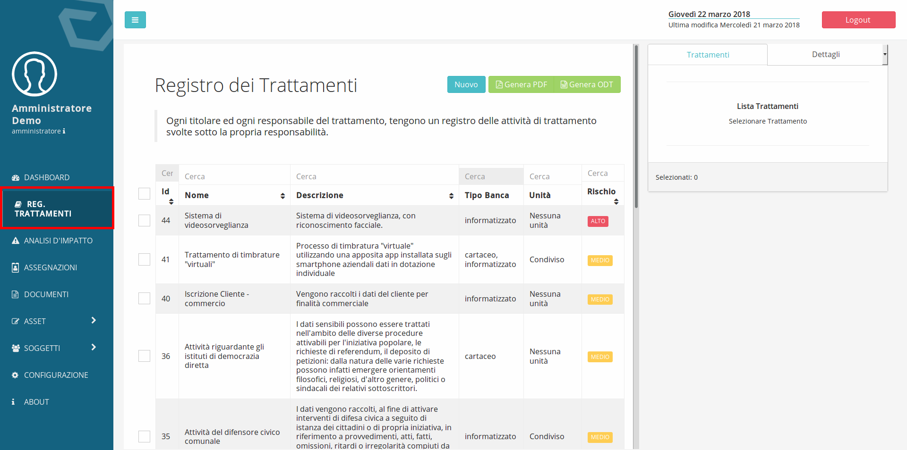

############################
Registro dei trattamenti
############################

Il registro dei trattamenti costituisce la pietra angolare su cui
poggiano molti degli adempimenti richiesti dal Regolamento EU 679/2016
(GDPR) quali: analisi d’impatto sulla protezione dei dati, la notifica
di violazioni sui dati personali, la distribuzione delle responsabilità.

Il registro dei trattamenti è composto dall’insieme dei trattamenti per
il quale l’ente è Titolare o è Responsabile.

Per accedere al registro dei trattamenti in DPM è sufficiente fare clic
sulla voce di menu **Reg. Trattamenti:**

Caratteristiche e elementi del registro dei trattamenti
--------------------------------------------------------

I trattamenti possono essere disattivati, questo permette di inserire
attributi ed elementi del trattamento ed eventualmente, fare un’analisi
di impatto, in una fase precedente all’implementazione del trattamento
nella realtà organizzativa dell’ente e quindi al loro inserimento nel
registro.

Per disattivare un trattamento è sufficiente spostare il
cursore che si trova nella prima sezione del trattamento:

Un’attività di trattamento è composta da cinque sezioni nelle quali sono
racchiuse tutte le informazioni correlate con l’attività di trattamento.

Le informazioni richieste in ogni trattamento sono quelle definite
nell’articolo 30 del regolamento 679/2016 con l’aggiunta di alcune
informazioni funzionali all’implementazione di misure di sicurezza
organizzative (quali la definizione di un responsabile interno) e alla
generazione delle informative (quali la presenza di meccanismi di
profilazione e meccanismi decisionali automatizzati).

Nel dettaglio, le informazioni correlate ad ogni attività di trattamento
sono suddivise nelle schede:

+-----------------------+----------------------------------------------------------------------------+
| Dati esenziali        | -  Nome e descrizione                                                      |
|                       |                                                                            |
|                       | -  Finalità                                                                |
|                       |                                                                            |
|                       | -  Basi legali                                                             |
|                       |                                                                            |
|                       | -  Ambito del processo                                                     |
|                       |                                                                            |
|                       | -  Tipo dati                                                               |
|                       |                                                                            |
|                       | -  Categorie di dati                                                       |
|                       |                                                                            |
|                       | -  Origine dei dati                                                        |
+-----------------------+----------------------------------------------------------------------------+
| Soggetti              | -  Categorie di interessati                                                |
|                       |                                                                            |
|                       | -  Titolari                                                                |
|                       |                                                                            |
|                       | -  Responsabili interni                                                    |
|                       |                                                                            |
|                       | -  Responsabili interni                                                    |
|                       |                                                                            |
|                       | -  DPO                                                                     |
+-----------------------+--------------+-------------------------------------------------------------+
| Trasferimenti e       |              |Intra UE                                                     |
| comunicazioni         | Destinatari  +-------------+-----------------------------------------------+
|                       |              |Extra UE     | Base legale per export di dati                |
+-----------------------+--------------+-------------+------------+----------------------------------+
| Misure di sicurezza   | Misure di sicurezza organizzative                                          |
+-----------------------+----------------------------------------------------------------------------+
| Altro                 | -  Profilazione                                                            |
|                       |                                                                            |
|                       | -  Processi decisionali automatizzati                                      |
|                       |                                                                            |
|                       | -  Periodo di conservazione                                                |
|                       |                                                                            |
|                       | -  Applicativi                                                             |
+-----------------------+----------------------------------------------------------------------------+

Molte delle informazioni che possono essere inserite durante la
compilazione del registro derivano da quanto inserito nelle voci dei
sotto-menu a cui è possibile accedere dalle voci del menu, **Asset** e
**Soggetti**.

Nel sotto menu **Asset** è possibile definire:

+---------+-------------------------------+
| Asset   | -  Applicativi                |
|         |                               |
|         | -  Categorie di dati          |
|         |                               |
|         | -  Categorie di interessati   |
|         |                               |
|         | -  Controlli di sicurezza     |
|         |                               |
|         | -  Periodo di conservazione   |
|         |                               |
|         | -  Dispositivi                |
|         |                               |
|         | -  Misure di sicurezza        |
|         |                               |
|         |    -  Tecniche                |
|         |                               |
|         |    -  Organizzative           |
+---------+-------------------------------+

Nel sotto menu **Soggetti** è possibile definire :

+------------+--------------------------------------------------------------+
| Soggetti   | -  DPO o RDP                                                 |
|            |                                                              |
|            | -  Qualifiche (del personale)                                |
|            |                                                              |
|            | -  Ruoli – (vedi 2.1 Privilegi utenti e ruoli predefiniti)   |
|            |                                                              |
|            | -  Terze parti                                               |
|            |                                                              |
|            | -  Titolari                                                  |
|            |                                                              |
|            | -  Unità                                                     |
|            |                                                              |
|            | -  Utenti                                                    |
+------------+--------------------------------------------------------------+

L’inserimento delle attività di trattamento si configura come un
percorso che accompagna l’utente nella compilazione dei campi necessari
per definire i trattamenti.

Correlazione trattamento Unità
-------------------------------

La correlazione dei trattamenti alle unità è essenziale se si intende
effettuare una gestione dei trattamenti in maniera distribuita,
raccogliendo quindi le informazioni concernenti i trattamenti dai
soggetti posti in posizione apicale nelle diverse unità organizzative.

Un trattamento può essere correlato ad una o più unità. Per
correlare un trattamento a delle unità occorre selezionare il **Registro
dei trattamenti** dal Menu principale, selezionare un trattamento,
espandere l’ultima voce della sezione **Dettagli del trattamento**
denominata **Unità associate** posta sul lato destro dell’interfaccia:

.. image:: ../_images/trattamento_unita.png
   :width: 500px