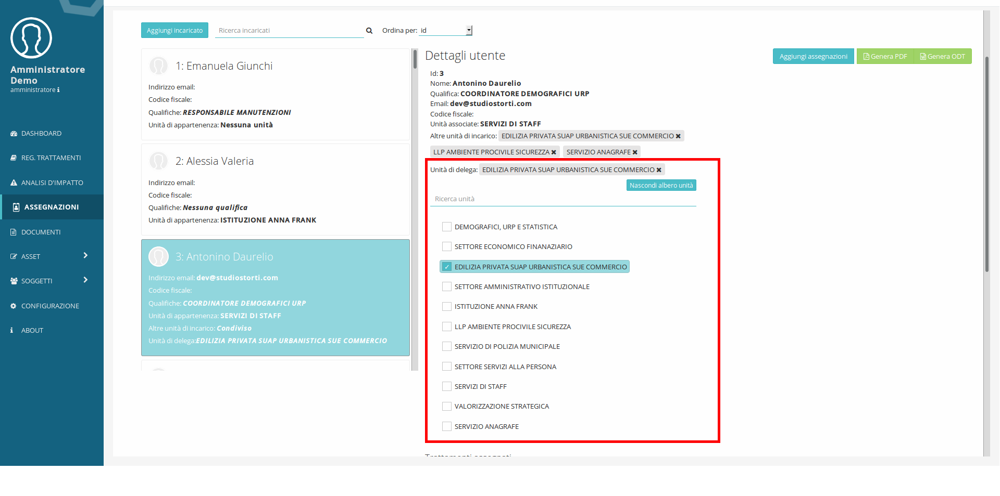

####################################
Distribuzione responsabilità interna
####################################

Nomina responsabili/referenti interni
--------------------------------------

Ai fini di una efficace implementazione delle misure di sicurezza organizzative, in una organizzazione complessa può essere utile individuare delle figure di riferimento in materia di privacy all'interno delle unità organizzative. La loro individuazione permette di rafforzare la messa in atto di misure di sicurezza organizzative quali procedure formali di rilascio delle credenziali applicative o agevolare il censimento delle attività di trattamento in modalità distribuita.

Un responsabile/referente privacy interno può essere individuato per ciascuna unità organizzativa e/o per ciascun trattamento.

- Per correlare Unità a responsabili/referenti fare riferrimento a quanto descritto nel capitolo Gestione delle unità organizzative e dei loro responsabili_
- Per correlare trattamenti a responsabili/referenti vedi Registro dei trattamenti_

Interfaccia per nomina incaricati
----------------------------------

La distribuzione della responsabilità passa necessariamente attraverso
la correlazione di attività di trattamento a soggetti interni ed esterni
all’ente.

Per correlare i soggetti esterni e quelli interni in posizione apicale
(Responsabili esterni ed interni), è necessario utilizzare la scheda
**Soggetti** presente al secondo passo del percorso guidato del registro
dei trattamenti 'Caratteristiche e elementi del registro dei trattamenti'_

Per gestire le assegnazioni di **Trattamenti, Applicativi e
Dispositivi personali** è necessario utilizzare l’interfaccia
**Assegnazioni** alla quale è possibile accedere utilizzando il menu
posizionato sul lato sinistro dello schermo e facendo clic sulla voce
**Assegnazioni.**

Tramite questa interfaccia è possibile visionare i **Trattamenti** gli
**Applicativi** e i **Dispositivi personali** assegnati ad ogni soggetto
censito in anagrafica (**Soggetti→ Utenti**), nel caso il soggetto che
effettui l’accesso sia il Responsabile di unità organizzativa
(Responsabile interno), questo avrà visibilità degli utenti facenti
parte della sua unità.

Meccanismo di delega
---------------------

Un responsabile di unità organizzativa può delegare un utente affinché
questo possa assumere i privilegi definiti per i “delegati” (vedi
capitolo 2.1), per delegare un utente il responsabile dovrà fare clic
sul pulsante **Mostra albero unita** e selezionare le unità (apponendoci
una spunta) per il quale lo intende delegare, fermo restando che un
responsabile può delegare solo per le unità delle quali è responsabile.

Assegnazioni agli incaricati
-----------------------------

Tramite DPM è possibile tracciare i **Trattamenti**, gli **Applicativi**
e i **Dispositivi** a cui sono abilitati i soggetti incaricati del
trattamento, o come definiti dal regolamenti le persone autorizzate al
trattamento dei dati. Per questo si utilizza l’interfaccia delle
assegnazioni, a cui si accede tramite un clic sulla voce di menu
Assegnazioni.

Una volta effettuato l’accesso si ha visibilità delle persone fisiche
appartenenti all’unità di cui si è responsabili o delegati.

**[ATTENZIONE: Si sconsiglia di procedere all’assegnazione di Asset con
utenze di Super Amministratore]**

Facendo clic nella colonna sulla sinistra dell’interfaccia, sulla scheda
che rappresenta un incaricato si visualizzano gli oggetti correlati con
il soggetto e le lettere di nomina generate fino a quel momento.

Per correlare un **Trattamento, Applicativo o Dispositivo personale
(Asset)** ad un soggetto:

1. fare clic sulla scheda che rappresenta la persona a cui si vogliono
   assegnare gli Asset

2. scegliere il tipo di Asset

3. fare clic sugli elementi da assegnare

4. scorrere fino in fondo all’elenco e fare clic sul pulsante
   **Assegna**

